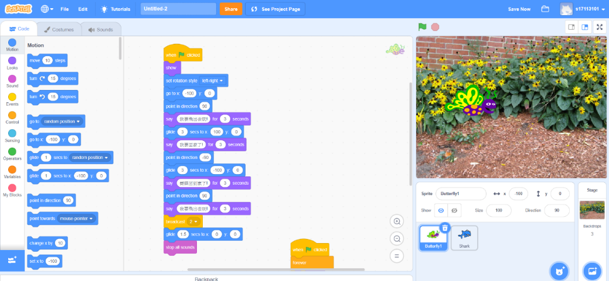
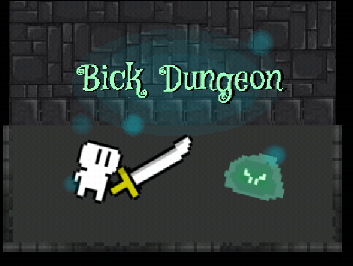
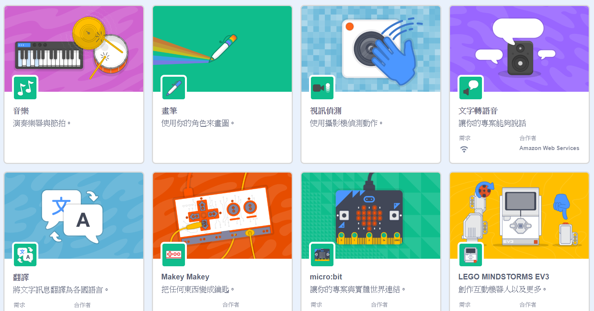
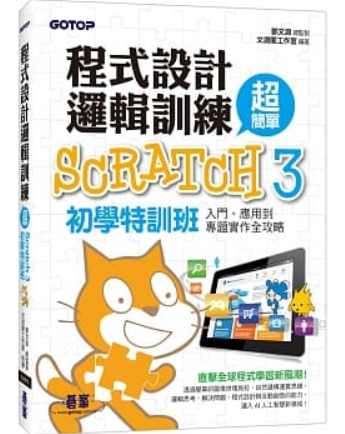

## 前言
不知大家曾經國中小的時候，有沒有使用過Scratch？
我大學剛好有一門必修需要用到這個軟體，
才知道很多的同學都沒有使用過，或者是都太小看Scratch，
這次就是要來跟各位分享，為何要學，以及可以用Scratch做出什麼樣的東西～

## Scratch是什麼？有哪些特色？
Scratch我又稱作貓咪（因為他的形象圖示是一隻貓），
是麻省理工媒體實驗室開發的一套，讓大家免費初步學習程式的平台，
利用積木式程式，堆疊出指令，去製作控制或改變物件行動和變化，
讓從未學過程式語言的人，也可以輕易上手。

可經由Scratch學習到程式的架構，以及數學邏輯方面的運算，
同時也能激發出創意性與思考能力；所以在學習其他程式語言之前，
可以先利用Scratch理解程式方面的邏輯架構。

擔心程式都是英文？
Scratch提供了40多種語言版本，包括中文，所以不用擔心看不懂的問題。

他也有提供許多的基本教學，所以一開始還完全搞不清楚的人，
可以先試著從教學開始做起，而想看更多人的作品，
也可在網站的首頁中看到其他人分享的作品，
不只能打開其他人作品的程式碼查看，
還能進行改編程式碼，來使得作品更加的多樣化等。
 

## 從Scratch中能增強思考能力？創造力？
Scratch主要是將程式的架構，用積木式程式來呈現，
所以多加使用及研究，就能增強程式邏輯。

可以利用Scratch製作出如故事、遊戲、動畫等作品，
在創造力及設計方面，都會有所幫助，
雖然沒辦法做太複雜的設計，但這也能考驗製作者們，
對有限的資源，該如何做出最好的作品。

時常會有人說，這東西明明就是國中小在學的，
但我覺得不管是什麼年齡都可以學習使用，
長大後變得更聰明，那是否可以做出更困難的作品呢？
（這是小編我大學做作品時所想的事情）
 

## Scratch不斷進步與改善的功能，你知道哪些?
從我國中小使用，到大學使用的，
差距非常的大，差在哪呢？

首先，先以我使用到的功能去詳細做說明～

### 函式
這是我覺得在更新方面，最有幫助的一個功能，
雖說在這裡的函式，只能使用在一個角色身上，
但這已經解決之前沒辦法讓一個角色充當多個角色使用的問題。
（這個部分，之後會再做更詳細的文章來做說明）

### 角色分身
這算是舊功能，感覺上是有優化過了；
分身在許多時候是非常好用的，例如搭配函式時，可以做出更多樣的變化，
能使得使用者不須製作更多的角色，去應付重複的指令。

### 清單（陣列）
以前就有所謂的變數，但現在變數多增加了清單，
如果有學過程式的人，會直接叫陣列，
因為功能就跟陣列一樣，可以產生多個位置存放數值，
缺點是只能使用一維陣列，這其實不是什麼太大的問題。

### 網頁版與離線版
之前Scratch只能使用離線版，而至從有了網頁版，
就能在網站製作作品，以及看到更多人的作品，
如果對各個作品有興趣，還可以將程式匯出，
在載入至離線版或是自己的網頁版中，
而現在網頁版可以雲端存放作品，
並將此作品分享給更多使用者看到。

### 更多的教學及資源
新增了許多的素材，也有補充了一些動畫，
而在教學方面是改變最多的，
教學現在分成動畫、藝術、音樂、遊戲、故事，
需要靈感時也能去教學裡式式一些專案，
可能會帶給你更多的驚喜喔！～

### 更多擴充功能
擴充功能是可以新增額外的功能，
例如連結搖桿或製作翻譯等功能，
主要是運用在機器人或馬達等實體控制，
讓Scratch連接更多實體設備，發展多元化的創作作品。

 

## Scratch這麼簡單，還需要書嗎？
需要，對於剛加入的使用者或是需要靈感的人，
我推薦這本『程式設計邏輯訓練超簡單 Scratch 3初學特訓班』
 

這本書的優點是不僅非常詳細說明各個Scratch中的功能，
並且有專題可以供各位去實作練習，
如果想要挑戰比較進階的部分，也有進階專題供各位去挑戰。

## 了解Scratch的相關資料後，有近一步的理解嗎?
還覺得這是個只有國中小能使用的軟體嗎？
如果認真研究及創作，也是可以做出非常有特色的作品，
而不管在做任何事之前，都需要把基礎學好，
所以鍛鍊自己的基本功也是非常重要的，
由其是要寫程式的人，可以增進自己的邏輯能力，
使未來在編寫程式時，如何使用會較為精簡方便。

要如何創作屬於自己的作品？
那就要看你們想創作怎樣的作品拉！
小編我之後會發布一些複雜的運用方法～
如果想對Scratch有更多的了解，
或是想要看看其他人有哪些製作方法的話，
千萬不要錯過接下來的文章喔～

Scratch其實還有許多意想不到的創作作品與功能，
需要各位自行去摸索與創作拉～

你了解Scratch了嗎？
這邊做個優點整理：
* 未寫過程式的人，也能輕鬆學習。
* 可增強創造力，以及邏輯性。
* 擁有40多種語言版本，不用擔心看不懂。
* 網頁版與離線版，方便讓你在哪都可以創作。
* 可查看與改編他人作品，讓自己與別人的作品更上一層。
* 多種教程讓使用者更加了解各個功能。
* 多樣素材免費供使用者使用。
* 方便工具，協助創作角色與匯入匯出專案。

有對Scratch的其他想法歡迎在下方留言喔～
也能分享一下當你想到Scratch的作品時，
你會有什麼樣的想法呦！

